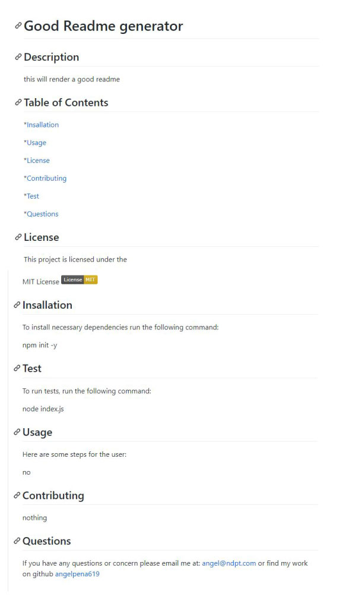

  # Homework Good Readme Generator
  
  ##  Description
   in this assigment we were asked to create a readme.md Generator, using new technologies learned in class. In this case NODE JS and Inquierer.
   this program runs through the terminal. here is a link to the walkthrough video: 
   https://drive.google.com/file/d/1gGU2DVS9BNbhw5TC8hK5RuNccrRfyD6r/view?usp=sharing
   
   the user is asked a series of questions to render the markdown, the markdown file is rendered by the fs.write file tool.

   
  ## Screenshot
   

  ## Table of Contents

  *[Insallation](#Insallation)
 
  *[Usage](#Usage)

  *[License](#License)

  *[Contributing](#Contributing)

  *[Test](#Test)

  *[Questions](#Questions)

  
  ## License
   This project is licensed under the 
   
  

  ## Insallation
   To install necessary dependencies run the following command: 
   
npm init -y

  ## Test
   To run tests, run the following command: 
   
node index.js

  ## Usage
   Here are some steps for the user: 
   the user must run 

  ## Contributing
   nobody
   
  ## Questions
  
  If you have any questions or concern please email me at: 
  angel@ndpt.com
  or find my work on github
  [angelpena619](https://github.com/angelpena619)
  
